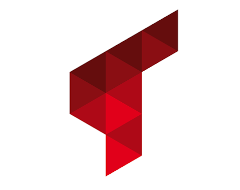

# Desafio - Target Sistemas

<div align="center" style="background-color: white; padding: 10px;">
  
</div>
<h2 align="center"> Etapa do processo seletivo da vaga Estágio Análise e Desenvolvimento na Target Sistemas </h2>


## 📖 Sobre o Projeto
O projeto consiste em uma aplicação Web com Python para resolver as questões do Desafio da Vaga na Target Sistemas mais informações [Ver](docs/Desafio.md)


## 🚀 Tecnologias e Ferramentas

A aplicação foi desenvolvida em Python com interface Streamlit.

## Stack do Projeto

Este projeto é uma aplicação web simples que utiliza o Redis, uma biblioteca de armazenamento de estrutura de dados em memória NoSQL, e o Streamlit, uma biblioteca open-source em Python que permite a criação de aplicativos web para análise de dados de forma extremamente rápida. O objetivo é demonstrar as capacidades e a integração do Streamlit com o `redis-py`.

Essas e outras libs e tecnologias usadas neste projeto são:
|  Lib      | Versão    |
|-----------|-----------|
| **Runtime**           |
| Python    | v3.12.x   |
| redis     | v5.0.x    |
| **Devtime**           |
| Ruff                          | v0.4.x    |
| Docker Engine                 | vx.x.x    |
| Taskipy                       | v1.12.x   |

### Organização do projeto
```
/
├─📁 .devcontainer     ->  Configurações do devcontainer
├─📁 .vscode           ->  Definições de ambiente para o VSCode
├─📁 docs              ->  Artefatos para documentação do repo
├─📁 src               ->  [Implementação da Desafio]
│ │ ├─🐍 playground.py              -> Entrypoint
│ │ ...
│ ├─📁 assets               ->  [recursos externos]
│ │ │ ├─📁 imgs             ->  [Imagens utilizadas pela Aplicação]
│ │ │ │   ...
│ │ │ ├─📁 lang             ->  [Config TOML utilizado pela Aplicação]
│ │ │ │   ├─⚙️ ui_labels.toml         -> toml para Ui da Aplicação
│ │ │ │   ...
│ │ ├─📁 page               -> [Paginas]
│ │ │     ├─🐍 home.py               -> Pagina Home
│ │ │     ├─🐍 tarefa_x.py           -> Pagina de tarefa x
│ │ │     ...
│ │ ├─📁 config             -> [Configurações/Funções da Aplicação]
│ │ │ │   ├─🐍 load.py              -> Funções utilitárias
│ │ │ ├─📁 functions        ->  [Funçoes para Aplicação]
│ │ │ │   ├─🐍 xxxx.py              -> Funções para Aplicação
│ │ │ │   ...
│ │ ...
├─📄 .gitignore
├─📄 Makefile          ->  Automações para o ambiente
├─📄 pyproject.toml    ->  Definições para o projeto
├─📄 README.md

```

## Montando o ambiente

Este repositório esta organizando em um devcontainer.
E para instacia-lo no VSCODE é recomendado as seguintes configurações:

#### Extenções recomendadas

- Name: Remote Development
- Id: ms-vscode-remote.vscode-remote-extensionpack
- Description: An extension pack that lets you open any folder in a container, on a remote machine, or in WSL and take advantage of VS Code's full feature set.
- Version: 0.25.0
- Publisher: Microsoft
- VSCode Marketplace Link: https://marketplace.visualstudio.com/items?itemName=ms-vscode-remote.vscode-remote-extensionpack

#### Docker Engine

É obrigatório ter o Docker Engine já instalado e cunfigurado. Para mais informações de como instalar o Docker Engine em seu SO, ver em:

- Instruções para instalação do Docker Engine: [Ver o link](https://docs.docker.com/engine/install/)

#### Procedimento para instanciar o projeto no VSCODE
1. Com o pack de extenções instalado,
1. Realize o clone/fork deste repositório,
1. Abra o diretorio deste repositorio no VSCODE como um projeto,
1. Use o Comando _Dev Containers: Reopen in Container_ da paleta de comandos do VSCODE. _(F1, Ctrl+Shift+P)_.

Depois da compilação do container o VSCode abrirá o repositório em um ambiente encapsulado e executando diretamente de dentro do container como configurado nas definições do **/.devconainer**.

#### Procedimento para iniciar
1. inicie o ambiente virtual do poetry
```
$> poetry shell
```
2. instale as dependencias definidas no pyproject.toml
```
$> poetry install
```
- Pronto agora voce esta pronto para começar a usar!


### Principais comandos:

#### Levantar a aplicação
```
$> make playground
```

#### Adcionar novas dependencias
```
# Adicionar uma nova lib para o runtime do projeto
$> poetry add <<nome_da_lib>>

# Adicionar uma nova lib para o ambiente de desenvolvimento
$> poetry add <<nome_da_lib>> --group dev
```
